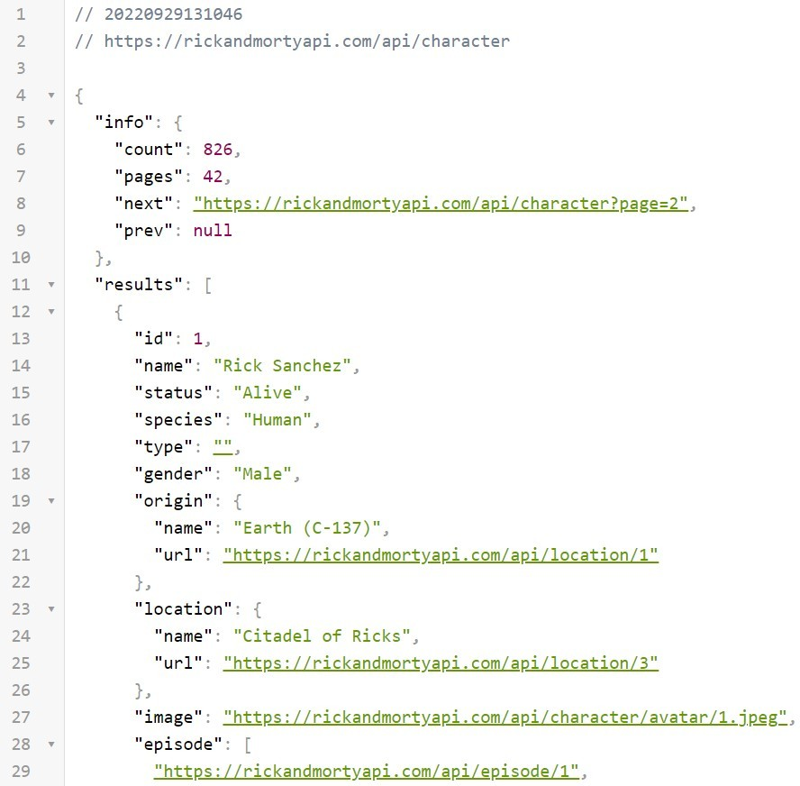

# CHARATERISTICS OF THE APIS

## RICK AND MORTY

### **The Rick and Morty API**

Basically what it does is quite simple when we make a get request and it gives us an array of .JSON objects and each object has information about a character in the series, so all we are going to do is make a get request.

<figure><figcaption></figcaption></figure>

What we are going to see is an object with two properties, one called info and an array of objects, each of these objects being each character in the series.

### UseEffect

In the app I am going to tell it that I am going to fetch the data as soon as the application loads to be able to do that I am going to import from react to useEffect this is basically a function that allows us to be able to execute or render the application when a piece of data changes but it also allows us to It allows to execute code when the component is created, that is, if I execute useEffect when the component is created, it will allow me to execute logic within the function, so for example if we create this effect in this way with an empty array as second parameter what we are telling you is that it is not going to change because there is nothing here to base it on so not as I have placed nothing well but that this is only executed once.

<figure><figcaption></figcaption></figure>


In this case, to make the request, I am going to be using the API that the browser gives me called fetch, so I am going to paste the address that we have copied from the browser into the fetch. This here is a request to another server, that is, it is a request to a back-end in this case to the back-end of the Rick and Morty API, this right here that is synchronous that is to say this is going to take some time to have the data so I will write the await instruction and save it in a constant of name response.

<figure><figcaption></figcaption></figure>

This response is actually a promise object, it is an object that I am not going to be able to understand easily, so what I am going to do is convert this object to a json, this conversion also synchronizes that, so at the beginning I am also going to place an await, now this here when it is finally converted it will return a json object and I will save a constant called data.

<figure><figcaption></figcaption></figure>

For all this to work I need this function with the away to be inside an async function so I am going to create a function called fetchData at the beginning of the function the word async must go, that what will allow us is that it is create a function that allows me to be able to write the async - await syntax.

This function is created but I'm not calling it so the useEffect can basically contain inside also in function declarations and in this case I'm creating a function that immediately executes it when the application loads.

<figure><figcaption></figcaption></figure>

### Catching Errors

As a good practice we capture possible errors, we do this if for some reason the API server goes down. For that we will use a Try - Catch and show possible errors in the console.

<figure><figcaption></figcaption></figure>

### UseState

To access this data from the interface I'm going to have to store it somewhere, with react I can use a useState this is a Hook that allows you to add React state to a function component, so I'm going to write to useState and I'm going to give it a name in my case I am going to place all these characters with the word characters I am going to save in this variable characters an array initially is going to be empty because when the application loads there is nothing, but when I bring the data this data is not there for me giving the characters or the characters, it's basically giving me an object with two properties info and results, so I'm going to pass the parameter setCharacters data.results.

<figure><figcaption></figcaption></figure>

### Return

This is our last step, show the results of our partition in the browser, this is simple, I'm going to go through the array of characters and I'm going to paint their name and image in the browser.

<figure><figcaption></figcaption></figure>

## POKE API

## API Reference <a href="#api-reference" id="api-reference"></a>

Pokédex API is based on a single layer, a HTTPS/REST consumption-only API that only allows the `GET` method to consume all the Pokémon information you’ll ever need.

## Base URL <a href="#base-url" id="base-url"></a>

The base URL for all API requests is:

```
https://pokeapi.glitch.me
```

## API Versioning <a href="#api-versioning" id="api-versioning"></a>

Pokédex API exposes different versions of the API. You can specify version by including it in the request path:

```
https://pokeapi.glitch.me/v{version_number}
```

Omitting the version number from the route will route requests to the current default version. We recommend specifying a version number in the request path so that your app doesn’t run into incompatibility when the default version is changed.V

| Version | Status    | Default |
| ------- | --------- | ------- |
| 1       | Available | ✔       |

## Authentication <a href="#authentication" id="authentication"></a>

No authentication is required to access this API. All the resources are and available to everyone. However, we will implement authentication methods in the future that will give authenticated users higher rate limits or no rate limits at all (more on [rate limits](broken-reference) later).

## User Agent <a href="#user-agent" id="user-agent"></a>

Applications and websites using the API must provide a valid [User Agent](https://www.w3.org/Protocols/rfc2616/rfc2616-sec14.html#sec14.43) which specifies information about the app and website, in the following format:

```http
User-Agent: AppName ($url, $version)
```

Applications and websites may append more information and metadata to the end of this string as they wish.

### Example User Agent Header <a href="#example-user-agent-header" id="example-user-agent-header"></a>

```http
User-Agent: BastionDiscordBot (https://bastionbot.org, 6.16.1)
```

## Rate Limiting <a href="#rate-limiting" id="rate-limiting"></a>

This API implements a process for limiting and preventing excessive requests in accordance with [RFC 6585](https://tools.ietf.org/html/rfc6585#section-4).

This API rate limits requests in order to prevent abuse and overload of our services. Rate limits are applied on a global basis, spanning across the entire API.

Because we may change rate limits at any time and rate limits can be different per application, rate limits should not be hard coded into your application or website. In order to properly support our dynamic rate limits, your application or website should parse for our rate limits in response headers and locally prevent exceeding of the limits as they change.


Current rate limit is 500 API calls in 12 hours. And we will increase the rate limits every time we upgrade our server for better performance.


We recommend that your application or website should locally cache the data that you receive to save the number of API calls consumed for the same resource.

### Header Format <a href="#header-format" id="header-format"></a>

For every API request made, we return optional HTTP response headers containing the rate limit encountered during your request.

```http
Retry-After: 1301000
X-RateLimit-Limit: 500
X-RateLimit-Remaining: 201
X-RateLimit-Reset: 905212800000
```

`Retry-After` - The number of milliseconds after which the rate limit will reset. It is returned only if you’ve been rate limited.

`X-RateLimit-Limit` - The number of requests that can be made

`X-RateLimit-Remaining` - The number of remaining requests that can be made

`X-RateLimit-Reset` - Epoch time (seconds since 00:00:00 UTC on January 1, 1970) at which the rate limit resets. It is returned only if you’ve been rate limited.

### Exceeding A Rate Limit <a href="#exceeding-a-rate-limit" id="exceeding-a-rate-limit"></a>

In the case that a rate limit is exceeded, the API will return a HTTP 429 response code with a JSON body.

| Field        | Type    | Description                                                           |
| ------------ | ------- | --------------------------------------------------------------------- |
| error        | integer | The HTTP response code.                                               |
| message      | string  | A message saying you are being rate limited.                          |
| retry\_after | integer | The number of milliseconds to wait before submitting another request. |

Note that the normal rate-limiting headers will be sent in this response.


API users that regularly hit and ignore rate limits will be banned (by their IP address) from using the API again.


### Example Rate Limit Response <a href="#example-rate-limit-response" id="example-rate-limit-response"></a>

The rate-limiting response will look something like the following:

```bash
< HTTP/1.1 429 TOO MANY REQUESTS
< Content-Type: application/json
< Retry-After: 14400000
< X-RateLimit-Limit: 500
< X-RateLimit-Remaining: 0
< X-RateLimit-Reset: 905212800000
{
  "error": 429,
  "message": "You are being rate limited. You're way too spicy at catching Pokémon.",
  "retry_after": 14400000
}
```

## META API

Meta API is an Open API platform that lets you accelerate your code, authentication, deployment, and monitoring processes. It is a SaaS platform that helps developers to integrate multiple applications. Meta-API is an automation tool where you have sets of actions and triggers.

#### How Does It Work?

* Meta-API is a automation tool where you have sets of actions and triggers.
* In Meta -API creating a new integration of any 2 or more applications is done via **“Spell”.** Helps you create new workflow for internal teams and for your clients.
* In Meta-API you have public API and private API where you can add your own API.
* You will create a new way and approach to code API automations and integrations via **Spell**
* All the tools are put inside this spell, so that you can create fast and reliable integration without struggling with configuration, undocumented features, authentication, serverless deployment, and monitoring.
* Here are parts inside a Spell:

1. **Connectors**: Manage connections between your code and external services, as well as configuration, data formatting, and authentication
2. **Code**: Your way to create logic in your workflow and process the data
3. **Dev environment**: It is an auto-reloading server for testing.
4. **One-click serverless deployment**: version your code and deploy it as a serverless function in a few seconds. This new API can be used anywhere.
5. **Monitoring**: Each connection is monitored automatically, and your program is likewise monitored. You’ll be informed if anything goes wrong, and debugging will be simple and quick.

### Features <a href="#features" id="features"></a>

Anyone who has ever tried to search for information on the internet knows how frustrating it can be. Whether you’re looking for that one article that you can’t seem to find or you need to find a certain set of data, the Meta API can help. Meta API offers a wide range of features that make it possible to create tools that help users find information on the internet. Deep linking, pagination, and data volumes management are just a few of the features that are available. Additionally, it’s possible to use the Meta API to create bots that act as interfaces between humans and online systems. So, whether you’re looking for a tool to help you with your search or you need to create a system that interacts with humans, the Meta API has you covered.

#### Authentication Management

<figure><figcaption><p>Api Authentication</p></figcaption></figure>

If you’re looking for an easy way to access different APIs, META-API is the right platform for you.

Meta api authentication will save time, effort and energy for your developers as they can concentrate on their coding rather than authentication task. now you don’t have to worry about searching for documentation or authentication formats – the directory is filled with ready-to-use apis.

You can use one of it’s public accounts to access your data in a hurry, or you may setup a fully customized **OAuth account**. This way, users can allow you to access their data through any Spells. We take care of security and authentication management like refreshing access token.

Encourages all authentication techniques like **OAuth, API Key, HTTP Basic, Bearer token**, and other forms of authentication. Inside your Meta API Authentication Center, all keys are securely stored.

#### Serverless Hosting

<figure><figcaption><p>Serverless Hosting</p></figcaption></figure>

Meta-Api is a powerful and secure backend as a service that allows you to create, edit and manage your own spells in an easy way. With its own technology for scaling and deploying Serverless functions on AWS, Meta-Api ensures the best performance for all users.

Meta API **** handles **security, scalability, and exposition** to speed up your workflow, allowing you to deploy your automation without any server configuration. It’s code editor allows you to write basic API requests and data transformations, and guarantee that your code will run every time with the best circumstances. It adds simplicity to this serverless architecture.

You may utilize your own servers and run limitless executions using their **open-source Runners technology**.

#### API Integration Monitoring

<figure><figcaption><p>Api Integration Monitoring</p></figcaption></figure>

Meta-Api is a monitoring system that allows you to measure your spells and requests in an insightful way. This will help you to better understand the dynamics of your magic, while keeping your data safe and protected at all times. All processing is done in streaming – meaning that no information is ever stored or kept on file once it has been processed.

Access the Spell, fix the mistake, or replace one of the faulty connections and deploy your Spell. Your corrective actions will be much quicker. Because the production URL will not change, your application will not need to be re-deployed or reconfigured.

Everything is done automatically, right out of the box, with Integration Data Monitoring. There is no need for configuration or code implementation. It’ll provide you with detailed logs on your own interface on the Logs page, starting from the first line of code.

#### Automation with low code

<figure><figcaption><p>Automation With Low Code</p></figcaption></figure>

Spells are an important part of the automation process. They bridge the gap between connectors and your code, providing a seamless way to automate actions and data exchange between APIs.

Once developed, a Spell is exposed as an endpoint that can be accessed by other developers through API calls. In addition to this, you can also call it a meta API – one that oversees all other endpoints created with Spell components in mind!

Access the Spell, fix the mistake, or replace one of the broken connections; then deploy your Spell. Your corrective actions will be much quicker. Since the production URL doesn’t change, your application won’t have to be re-deployed or reconfigured.

#### Meta Storage

<figure><figcaption><p>Meta Storage</p></figcaption></figure>

Meta Storage is a key/value database that simplifies the process of storing, retrieving and manipulating data from automation. The feature lets you **track, synchronize, and store data between spells and execution, as well as from your automation**, making it the ideal companion for implementing complex automation.

This database is shared among multiple automations, so you may exchange data from one account to the next. For implementing complicated automation, Meta Storage will be your best friend.

#### Code Editor

<figure><figcaption><p>Code Editor</p></figcaption></figure>

Looking for a full-featured editor that can help you write Spells and mix your own algorithms? Look no further than Code Editor. This code editor has all the features you need to design, build, test, and debug sophisticated JavaScript or Typescript applications. It also comes with an impressive auto-generated code feature that makes it easy to get started writing Spells in no time at all!

With Meta API online web editor, you can write code for complex processes and transform data the way you want.

**Edit code right from your browser** without having to install or download any files or solutions.

The Visual Studio (VS) code editor also lets you **extend written code with autocompletion for APIs**, so you can easily create your workflow.

You’ll even be able to **import external dependencies using NPM** to speed up your development process.

PROS:

* A good tool for coders.
* Easy to use
* Save a lot of time
* Cost-effective.
* Fast generation of code
* Multi-language support.

CONS:

* Meta API isn't the best platform for you if you're not a developer or don't need to deploy code quickly and simply.
